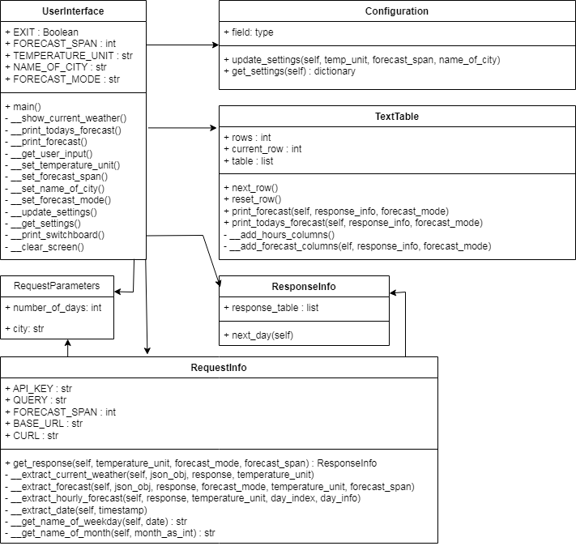

# Introduction
The script provides means to get a weather forecast or current temperature and weather conditions in any city on the planet,
as long as the API that I am using to get the data from, covers that city in their database. The script is intended to run in a terminal of a machine with a pre-installed Python Interpreter.
# Preparation
## Finding an API
I had to find an online API that meets the following requirements:
1. It is a free online API
2. It allows to choose the name of a city, instead of longitute and latitude coordinates
I read some reviews and narrowed it down to [Weather-API](https://www.weatherapi.com/)
I registered myself with the provider of the API and received an API-key.
# ISSUES
## Migration to a different repository
I started working on the Project as sson as I learned the most basic things about Python. So I manually created a repository on GitHub
and started working locally on VS Code.
Later on, during my second session with my mentor he said that we were supposed to use a template, provided by code institute
and deploy the project on Heroku.
To cut the long story short, I exported the Project to a different repository, that was created using the template. Therefore, the first
batch of commits is missing in the currently used repository.
There were only four commits in total and the intial source code. Here is the link to the first repository if you find it relevant 
[First repo](https://github.com/dimitri-edel/pp3.git)
## Size of the terminal
At first I adjusted the size of the terminal in the index.html that came with the template. It allowed me to have more space and create
larger tables, which could accomodate forecasts for up to seven days, without making it look messy. Neither me, nor my mentor were sure 
about how the assemsment team would feel about me changing the files, which Code Institute warned us agains changing. So, toward the end
I changed it back to the intial width of 80 columns. It's like they say: 'Customer is King!'
## API trial ended
That resolves the question about the size of the terminal. Because, today on 21st of April 2023, I received an email informing me that the trial period had ended. As a consequence, my account had been added to the free plan, which only provides three days of forecast.
## Single User (Heroku)
The Project has been deployed on Heroku, which is a public website and can be used by many people at the same time. In the course that I am currently enrolled in, we have not yet gotten around to session management with Python.
The project does not use a session or a database to store user data. If several users try to change the generated settings file at the same time, it will result in data inconsistency. The script is not intended for this purpose. It is intended to be copied to a particular machine and run locally.
Heroku merely serves as a platform for presentation purposes. However, I will implement session management in the project later on and store the settings in the session instead of storing them in a file.
# User stories
## Switching between names of location
First you need to set the name of the location / city. For this, you need to enter the command **city** 

**Now enter** the name of the **city**. In the image below I am entering **London** for the name.

Now you can see that the name of the city has been changed. **NOTE!** Once the name of city has been changed it will be added to the settings and all the other commands will use this location in the forecast querries.

## Switching between temperature units
The default setting is Fahrenheit. So, unless someone has already changed the setting to Celcius, you might have to change the setting to Celcius.
To set the temperature unit enter **set tu**.

Now enter **c** for Celcius or **f** for Fahrenheit.

Now you will see a message that lets you know what temperature unit you have just set.

## Swtiching between forecast modes
The script provides two forecast modes. One is the hourly forecast, which will give you estimated temperatures and condition for each hour of a day. The other one is average forecast mode, which will provide what temperatures and conditons you may expect on average for each day.
To switch between the two modes enter **set fm**. Forecast mode will not be saved to the settings file. It remains set only as long as the script is running in the terminal.

Enter **avg** for average or **hly** for hourly.

Upon entering the forecast mode you will see a message that lets you know which forecast mode has been set.

## Setting number of days in forecast
Enter **set fs**. FS stands for forecast span. **Maximum** number of days is **3**.

Enter a number between 1 and 3.

Now you will see a message informing you about the change.

## Information on the current weather
Enter **current** for current weather.

In the top row of the terminal yoou will see the current weather report.

## Getting the current day's weather forecast
Enter **today**

Now you can see a table with the forecast for the rest of the day, if you set the forecast mode to hourly using the **set fm** command. 

If you have set the forecast mode to average, then you will see a table that only shows the date and what kind of weather to expect on average thoughout the day.

## Getting several days of the weather forecast
Enter **forecast**

Now you can see a table with the forecast for the number of days that you have set using **set fs** command. The image below only illustrates a section of the actual table. The table you will see will cover 24 hours for each day.

If you use **set fs** and set the forecast mode to **average**. Then you will see a table with data that sums up each day only showing what to expect on average throughout the day.

## Entering invalid data
### Invalid command
If you enter an invalid command you will get an error message.

### City name is invalid
If the name of the city is not covered by the API, or you somehow misspelled the name you will see a message if you issue any of the commands for retrieving data from the API.

### Invalid forecast span
If you enter a number that is less than one or greater than the Maximum, you will get a feedback as depicted in the image below. Furthermore, the script will use either 1, if the entered number is less than 1. Or it will use the maximum, which is three, if the number exceeds that Maximum.

### Invalid forecast mode
If you enter an invalid forecast mode you will see a message that explains what happened and the forecast mode will be set to hourly.

### Invalid temerature unit
If yoou enter a letter that does not represent Celcius or Fahrenheit. You will see an error message.

# Code
## OOD
### Class diagram

#### Flow
The script **run.py** merely instantiates an object of type UserInterface and executes its main()-method. UserInterface is the crossroads where users input is evaluated and an according response is triggered, which happens in the method get_user_input().
#### TextTable class
This is simply a wrapper class for the functions provided by library named **tabulate**. Tabulate provides an easy way to print tables on the terminal. In order for this to happen the tabulate methods use a list, that has to comply with certain rules. This list is a property of the TextTable class named **table**.
#### Configuration class
This class handles writing and reading the **settings.sf** file that lives in the the **conf** folder.
#### RequestInfo class
The class handles HTTP request and response objects. It contains the settings for the API and so on. It sends a request to the API and then extracts data from the response, which comes back in form a JSON file. It turns the JSON file into a Paython dictionary and then parses through the dictionary collecting relevant information and putting it in a dictionary named **response_table** that sits in an object of type **ResponseInfo**.  All of that happens inside get_response() method, which returns an object of type **ResponseInfo**.
#### ResponseInfo class
Contains requested information inside **response_table**
#### RequestParameters class
Well, the name speaks for itself. It is used for passing parameters to the constructor of RequestInfo. I have only created this class just in case I were to decide to implement other types of requests to the API. For the time beeing, it only ecapsulates two parameters.
## BUGS
### API sometimes delivers more datasets than expected
A nasty bug found its way into my work today. The API started to deliver more hourly reports per day than the usual 24 hours.
This resulted in an index error in TextTable.addForecastColumns()-method, within the loop. The enty_index was getting out
of range. Took me over an hour of debugging and wrecking my mind to finally pin down the problem, becasue the code seemed to be doing exactly what it was supposed to. I was recieving forecasts for seven days at the time, and only two of them exceeded 24 entries, which I first noticed when I had the length of each set printed on the terminal. It still took me a litle bit to realize, that it was not because of what I did during the refactoring a few minutes prior, but it was coming from the API itself. I have no idea as to why the API started appending more hours, which technically belong in the dataset of the next day. However, I simply added two lines of code in the loop, which check if the number of datasets exceeds 24 (as in 24 hours), then these datasets will be skipped. You will find the fix **@ line 143 of api.py**

### Can not get textwrapper.dedent() method to do what it is supposed to do
The textwraper.dedent() method is not doing what it's supposed to. After applying it the text still appears indented in the
TextTable. Found this on stackoverflow.com <code> print('\n'.join([m.lstrip() for m in message.split('\n')]))</code>.
I adjusted that to my code and it worked, the multi-line text appears without indentions.

### An empty dataset appears in the forecast table 
The issue stemmed from a loop inside RequestInfo.__extract_forecast(). Solution, check if the execution araived at the end of the forcast and not execute response.nextDay(). You will find the fix **@ line: 129 of api.py**
# Technologies
- GitHub
- VS Code
- Heroku
- Python
# Deployment
## Local machine
If someone wants to use it on their local machine, they would have to copy the folders **conf** and **src** and the files **run.py** and **requirements.txt**  to a folder of their choice. Then open that folder in a terminal (Command prompt on Windows) and type the following command <code>pip install -r requirements.txt</code>. The command will ensure that all the packages required by this script are installed. Lastly, execute **run.py**. 
### Special request
If you intend to use it on your computer, then **PLEASE**  get an **API KEY** for yourself! It is **easy** to do. You only need to sign up at [Weather-API website](https://www.weatherapi.com/). All you need to provide is a valid **email-address** and **it does not cost a thing**. Then just copy the **API-key** into to the constructor of the class named **RequestInfo** in **api.py**. The name of the property in the constructor is **API_KEY**.
## Heroku
Before deploying the webapplication to Heroku, it is mandatory to compile a list of imports in the requirements.txt. Which the Heroku deployment script will use for setting up the environment. To do so, I just typed a pip command in the terminal <code>pip3 freeze > requirements.txt</code>
Next step is creating an account on Heroku. 
Once registered with Heroku, I went to the dashboard and created a new App.
Then I opened the App and went to the settings panel. Here it is necessary to set up a couple of configuration variables. One of them is PORT number must be set to 8000. 
Furthermore, I had to **Add buildpack**. First of all, the application runs on Python so this msut be added to the buildpack. Secondly, the application uses Node.js to emulate the terminal window. Node.js must be added to the pack as well. The order in which these dependencies are added to the pack do matter: 1. Python, 2.Node.js
Now comes the deployment part. I simply clicked on deploy on the dashboard. Then I had to connect to GitHub, which is easily clicking on the GitHub button that would appear as soon as I opened the Deploy window. Then I just followed the instructions. 
Lastly, I used the deploy from branch option to launch the site on Heroku. It only takes about a minute for the deployment script to start it up. One can see, in a litle window, all the messsages from the server as it is running through the script. As soon as it was fiinshed I saw a button labeled as **View**. I clicked on it and it opened the website. 

# Credits
## Code Institute
Code Instititute provideed the tutorials on essential knowledge of Python.
The template for the Heroku website and a step by step tutorial on how to deploy a project on Heroku was provided by the friendly team of Code Institute.
## stackoverflow.com
Provided solutions for a few problems, which I would not have been able to come up with on my own.
## w3schools.com
I oftentimes used this website, when I needed to quickly look up how to use certain classes and functions in Python. It posed a great helper in additon to the tutorials by Code Institute.
## My mentor Adegbenga Adeye
Special thanks to my mentor for the help and support throughout the project!

